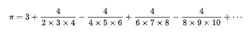

# π number 3.14...
### π is a mathematical constant that is ratio of a circle's circumference to its diameter. this number never ends, and it appears in many formulae.
# BBP formulae
### for this assignment I used this formulae to calculate the number π

* This formulae may not give you the exact value of π, But it's really close to actual value.
* You can see the difference between the calculated value and the actual value where you run the test with fewer threads.
```java
    public void run() {
        BigDecimal denominator1 = new BigDecimal(8*n + 1);
        BigDecimal denominator2 = new BigDecimal(8*n + 4);
        BigDecimal denominator3 = new BigDecimal(8*n + 5);
        BigDecimal denominator4 = new BigDecimal(8*n + 6);
        BigDecimal numerator1 = new BigDecimal(4);
        numerator1 = numerator1.divide(denominator1 , mc);
        BigDecimal numerator2 = new BigDecimal(-2);
        numerator2 = numerator2.divide(denominator2 , mc);
        BigDecimal numerator3 = new BigDecimal(-1);
        numerator3 = numerator3.divide(denominator3 , mc);
        BigDecimal numerator4 = new BigDecimal(-1);
        numerator4 = numerator4.divide(denominator4 , mc);
        BigDecimal result = numerator1.add(numerator2);
        result = result.add(numerator3);
        result = result.add(numerator4);
        BigDecimal denominator5 = new BigDecimal(16).pow(n);
        result = result.divide(denominator5);
        addToSum(result);
    }
```
* Here in `run()` I tell every thread to calculate a single deduction with a given value of **n**.
* After they calculate, the result will be added to a value where it stores sum of all results with the method `addToSum(result)`.
## Why did I get Wrong Answer?
* The last two test didn't give the right answer because the amount of thread was low.
* When I increased the threads number from 100 to 1000, an error pops up.
* The problem was when I wanted to calculate 16ⁿ I used `BigDecimal numerator5 = new Bigdecimal(Math.pow(16 ,n)` and because the number is big for a `int` it cannot make a Bigdecimal.
* So I used the pow from Bigdecimal class instead of Math's to calculate 16ⁿ.
* And now all tests works properly.
## Formulae I used

* This one is called Nilakantha's series.
* At first, I used this formulae, and As you can see it's much easier.
```java
    public void run() {
        BigDecimal sign = new BigDecimal(this.sign);
        BigDecimal numerator = new BigDecimal(4);
        numerator = numerator.multiply(sign , mc);
        BigDecimal denominator = new BigDecimal(n * (n + 1) * (n + 2));

        BigDecimal result = numerator.divide(denominator , mc);
        addToSum(result);
    }
```
* This was the code that I used to calculate the π number. Even though it was working properly, But when you want a higher floating point, It doesn't give you the exact value.
* Two last tests didn't pass with this formulae, so I changed it.
* Even if I increase the number of threads, It doesn't work.
## Execute the program
#### Start the program from main:
1. First you have to enter the floating point.
2. Then it makes ten threads with thread pool.
3. In a loop it calculates every series with a thread.
4. Every thread has `run()` method that I mentioned before.
5. After it done its work, we have to round the number by floating point.
6. All done, and it finally shows the π number with the floating number you chose.
- `Floating Point: 10`
- `π: 3.1415926535`
## How Thread Pool works
1. Declare a thread pool with `ExecutorService threadPool = Executors.newFixedThreadPool(10);`.
2. As you can see I made 10 threads.
3. In loop when I give task to thread all ten of them works parallel.
4. When one of them finished, the other thread replace with it.
5. These go until the loop finish.
# Semaphore
#### The best way to say what a semaphore is, It can be use like `Lock` but you can lock as many as threads you want.
##### The task is simple:
1. It wants us to Lock 2 threads at the same time using semaphore until they finished.
2. Shows which thread has done its task.
* #### I simply declare a semaphore in main method by using `Semaphore semaphore = new Semaphore(2);`.
* #### The number 2 is how many threads I want to lock in Operator class. So you can change it and lock as much as you want.
* #### **(It's really important to use a single semaphore for the whole program and pass it to methods)**
* #### in `run()` method where located in Operator class, I acquired the semaphore at the first of the method, And I release the semaphore at the end of it where the task of **Accessing to Resources** has done.
* #### So when we want to lock some threads at the same time we use Semaphore.
* not that if you want to use Semaphore you have to import its class.
# Resources
* [Formulas to find π (Wikipedia)](https://en.wikipedia.org/wiki/Pi)
* [Thread Pools (Geeks for Geeks)](https://www.geeksforgeeks.org/thread-pools-java/)
* [Semaphore (Geeks for Geeks)](https://www.geeksforgeeks.org/semaphore-in-java/)